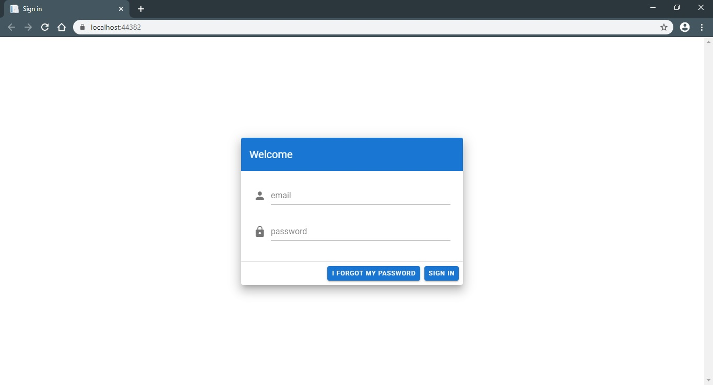
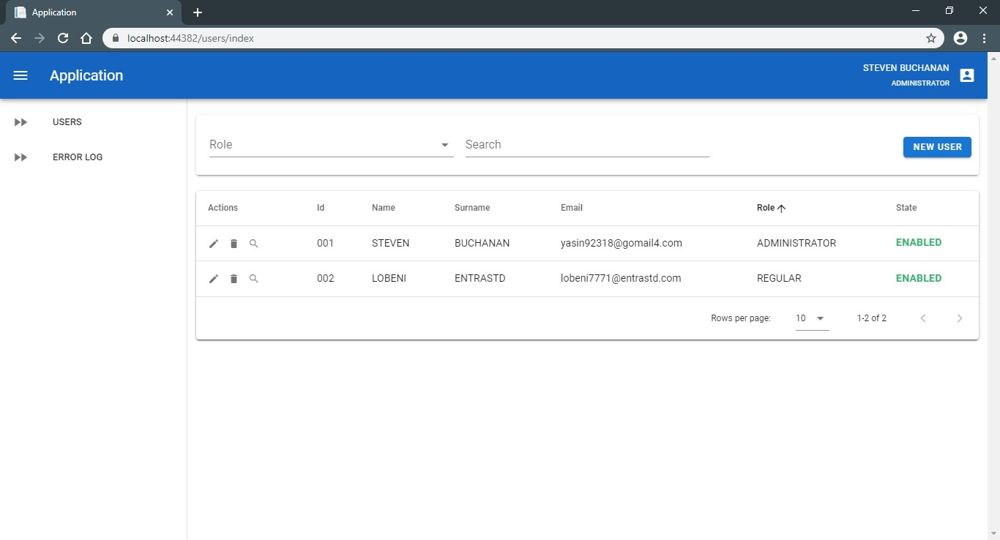
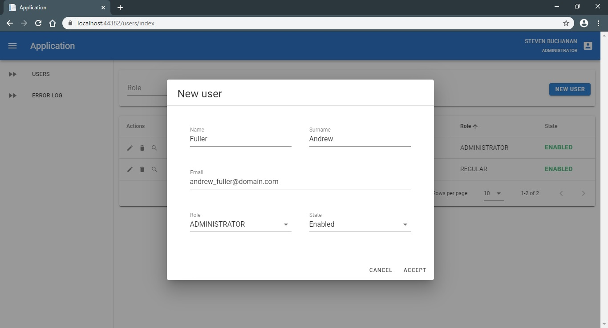
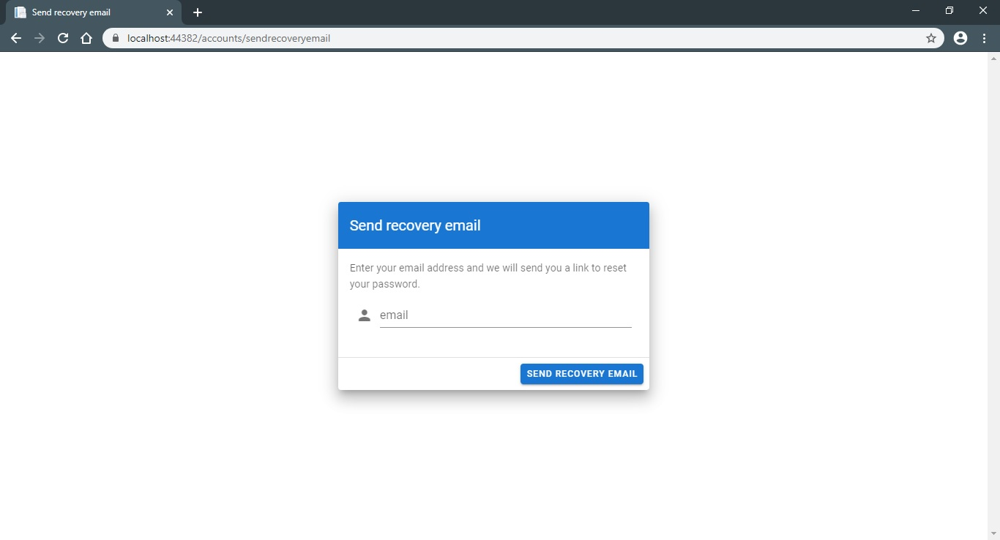
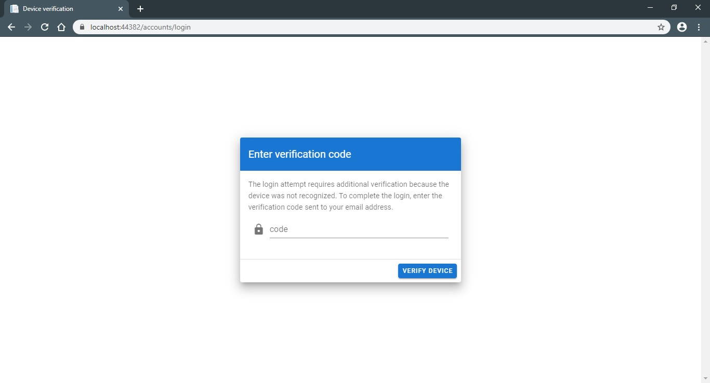

# Clean Architecture with ASP.NET Core and Vuetify

Clean Architecture with ASP.NET Core and Vuetify. A starting point for any of your projects.

## Technologies
- ASP.NET Core 3.1
- Vuetify.js Material Design Component Framework
- Lodash.js
- ElmahCore
- Entity Framework Core
- FluentValidation
- LigerShark.WebOptimizer
- MediatR
- Microsoft SQL Server
- SignalR
- Swagger

## Features
- Account recovery.
- Appsettings encryption at build-time.
- Automatic services registration at startup.
- Dockerfile configuration.
- Global error-handling middleware.
- Loosely coupled.
- Multiple authentication schemes.
- Real-time notifications with SignalR.
- Simplified CQRS pattern.
- Two factor authentication by email.

## Screenshots

## Resources

- *[Introduction to ASP.NET Core](https://docs.microsoft.com/en-us/aspnet/core/introduction-to-aspnet-core?view=aspnetcore-3.1)*
- *[Entity Framework Tutorial](https://www.entityframeworktutorial.net/efcore/entity-framework-core.aspx)*
- *[Vuetify](https://vuetifyjs.com/en/getting-started/quick-start/)*
